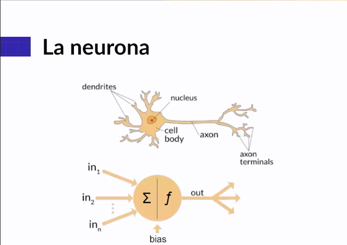

# Redes-Neuronales-con-Python-y-Keras
Desarrollo del curso de Redes Neuronales con Python y Keras

Un modelo secuencial en Keras es un tipo de modelo que se utiliza para construir redes neuronales de capas apiladas de manera secuencial. Cada capa tiene exactamente un tensor de entrada y un tensor de salida.

En otras palabras, en un modelo secuencial, la salida de una capa se convierte en la entrada para la siguiente. Esto es útil para construir redes neuronales de feedforward, donde la información se mueve en una sola dirección: desde la entrada, a través de las capas ocultas, hasta la salida.

Un tensor es una generalización de vectores y matrices a un mayor número de dimensiones. En términos simples, puedes pensar en un tensor como un contenedor multidimensional de datos.
    - Un tensor de 0 dimensiones es un escalar (un simple número).
    - Un tensor de 1 dimensión es un vector (una lista de números).
    - Un tensor de 2 dimensiones es una matriz (una tabla de números).
    - Un tensor de 3 dimensiones puedes imaginarlo como un cubo de números.
    - Y así sucesivamente para dimensiones más altas.

GitHub Copilot: Las funciones de activación en las redes neuronales son funciones matemáticas que determinan la salida de una neurona. Aquí te explico las dos que mencionaste:

1. **ReLU (Rectified Linear Unit)**: Esta es la función de activación más utilizada en las redes neuronales convolucionales. La función ReLU es `f(x) = max(0, x)`, lo que significa que la función devuelve `x` si `x` es positivo; de lo contrario, devuelve 0. La función ReLU introduce la no linealidad en nuestro modelo, lo que nos permite aprender de los datos más complejos.

2. **Softmax**: Esta función de activación se utiliza comúnmente en la capa de salida de un modelo de clasificación multiclase. La función Softmax convierte un vector de números en un vector de probabilidades, donde las probabilidades de cada valor son proporcionales a la proporción de ese valor sobre la suma de todos los valores. Esto significa que cada elemento del vector de salida de la función Softmax es un valor entre 0 y 1, y la suma de todos los elementos será 1.

ORDEN 
1. Importar librerías
2. definir los datos de entrenamiento y test. 
3. generar el modelo. 
4. Entrenar el modelo

