# Redes-Neuronales-con-Python-y-Keras
Desarrollo del curso de Redes Neuronales con Python y Keras

Un modelo secuencial en Keras es un tipo de modelo que se utiliza para construir redes neuronales de capas apiladas de manera secuencial. Cada capa tiene exactamente un tensor de entrada y un tensor de salida.

En otras palabras, en un modelo secuencial, la salida de una capa se convierte en la entrada para la siguiente. Esto es útil para construir redes neuronales de feedforward, donde la información se mueve en una sola dirección: desde la entrada, a través de las capas ocultas, hasta la salida.

Un tensor es una generalización de vectores y matrices a un mayor número de dimensiones. En términos simples, puedes pensar en un tensor como un contenedor multidimensional de datos.
    - Un tensor de 0 dimensiones es un escalar (un simple número).
    - Un tensor de 1 dimensión es un vector (una lista de números).
    - Un tensor de 2 dimensiones es una matriz (una tabla de números).
    - Un tensor de 3 dimensiones puedes imaginarlo como un cubo de números.
    - Y así sucesivamente para dimensiones más altas.

GitHub Copilot: Las funciones de activación en las redes neuronales son funciones matemáticas que determinan la salida de una neurona. Aquí te explico las dos que mencionaste:

1. **ReLU (Rectified Linear Unit)**: Esta es la función de activación más utilizada en las redes neuronales convolucionales. La función ReLU es `f(x) = max(0, x)`, lo que significa que la función devuelve `x` si `x` es positivo; de lo contrario, devuelve 0. La función ReLU introduce la no linealidad en nuestro modelo, lo que nos permite aprender de los datos más complejos.

2. **Softmax**: Esta función de activación se utiliza comúnmente en la capa de salida de un modelo de clasificación multiclase. La función Softmax convierte un vector de números en un vector de probabilidades, donde las probabilidades de cada valor son proporcionales a la proporción de ese valor sobre la suma de todos los valores. Esto significa que cada elemento del vector de salida de la función Softmax es un valor entre 0 y 1, y la suma de todos los elementos será 1.

ORDEN 
1. Importar librerías
2. definir los datos de entrenamiento y test. 
3. generar el modelo. 
4. Entrenar el modelo

Esta neurona se llama perceptrón.
Tenemos las entradas y pesos de la neurona (W). 
Dentro de la neurona tenemos sumas ponderadas. 
la B de Bias es para darle elasticidad a nuestro modelo. De manera que si da 0 la suma va a tomar otro valor por la elasticidad. 

En el siguiente ejemplo, variando los pesos y el Bias nos fijamos en la salida. En la primera imagen se evidencia que no es una compuerta AND

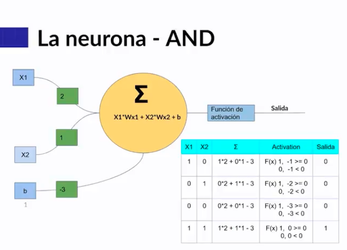

A diferencia de la AND y OR. 
Una XOR no puede ser generado por una sola neurona. Es por eso que utilizamos 2 neuronas.  

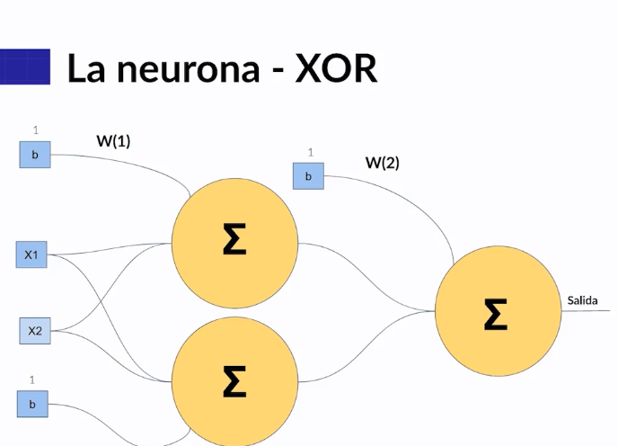

---------

**Arquitectura de una red neuronal**

La red neuronal la manejamos por capa. 
Cada capa avanza con respecto a la info. 
Entre más capas más exacta será la red. 
La capa de entrada será nuestra input layer. 
Todo lo que esté en la mitad lo llameremos capas ocultas. 
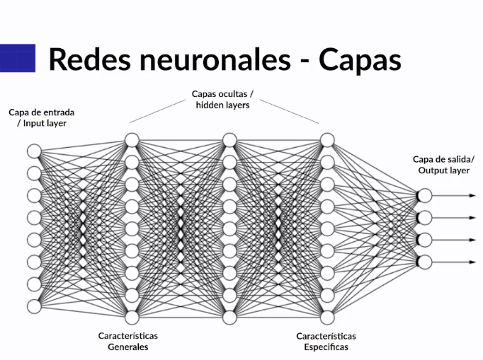

----------

Esto se llama como producto punto. 

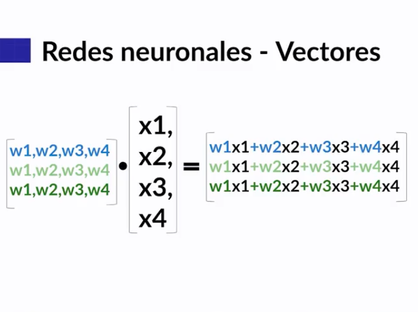
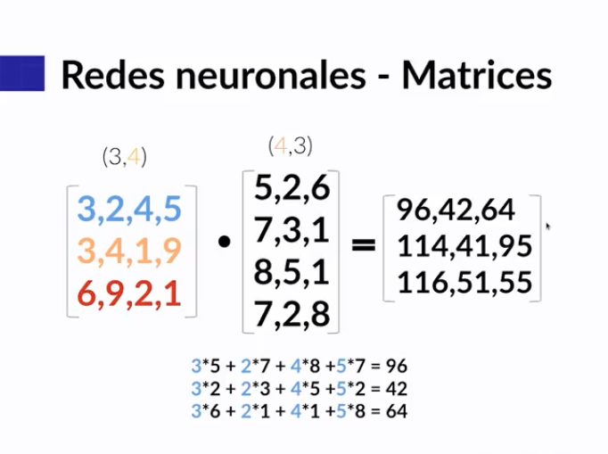

----------

## Funciones de activación

Las funciones de activación hacen referencia a una función matemática que se aplica a la salida de una neurona. Esto se realiza para introducir no linealidad en el modelo.

Hay funciones de activación discretas y continuas. 

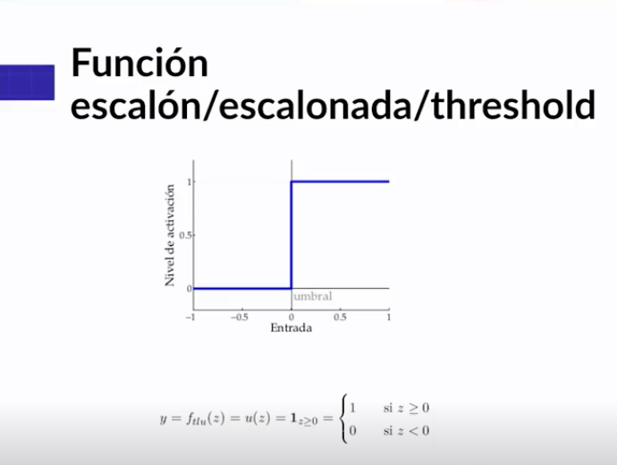

--

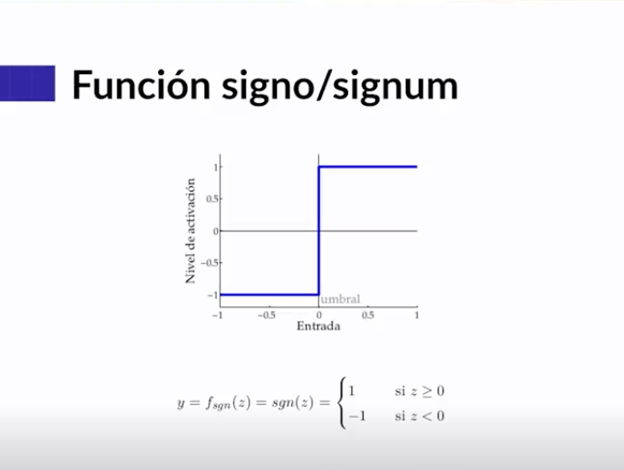

-- 
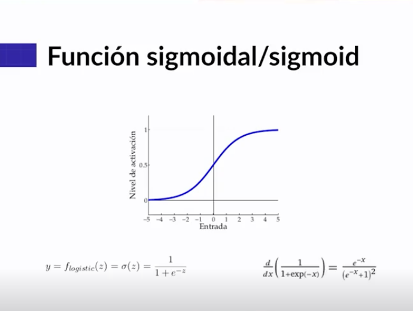
La sigmoidal es buena para probabilidades. 
Tiene desventajas porque los valores altos los acerca a 1 y los muy bajos a 0. 
Tiene una ventaja por la derivada en back propagation. 

--
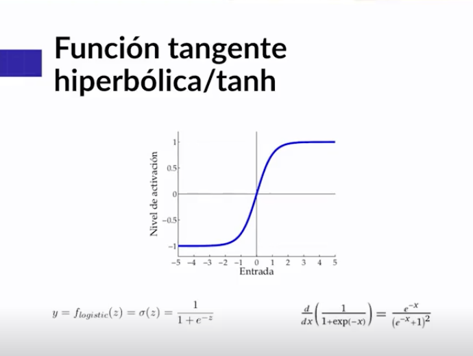

--- 

Función lineal rectificada 
Usada para capas ocultas
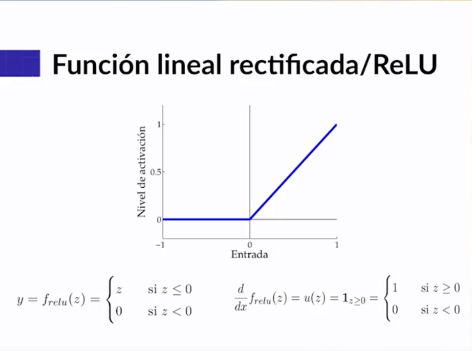

---
Función softmax 

Nos da la probabilidad de cada una de las posibles salidas. 
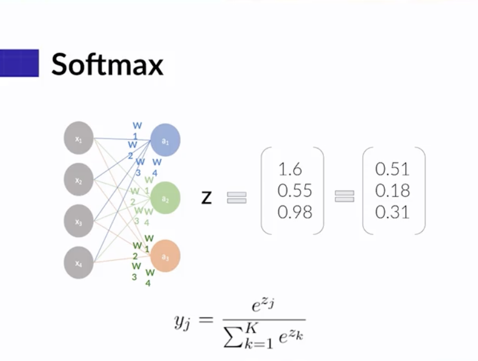

## Función de pérdida 

Es una forma de saber la calidad de predicción de nuestro modelo. 
Para esto, el modelo toma los valores reales con los que predice y genera un score. 
Si la función de pérdida es baja quiere decir que estamos cerca de realizar una predicción buena. 

# MSE Mean squared error 
Es una pérdida que se implementa en algoritmos de regresión lineal. 

| MSE  | MSE |
| ------------- | ------------- |
| 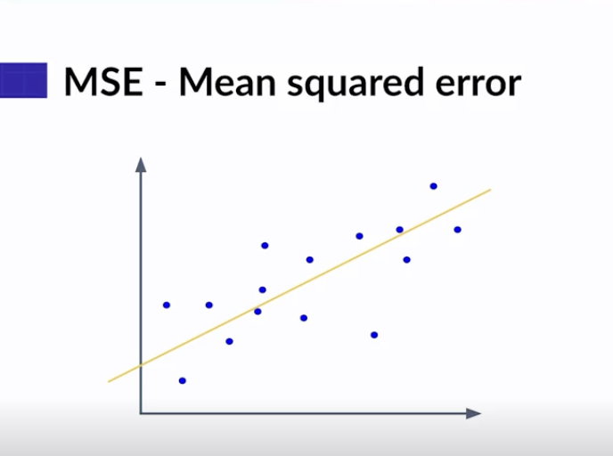  | 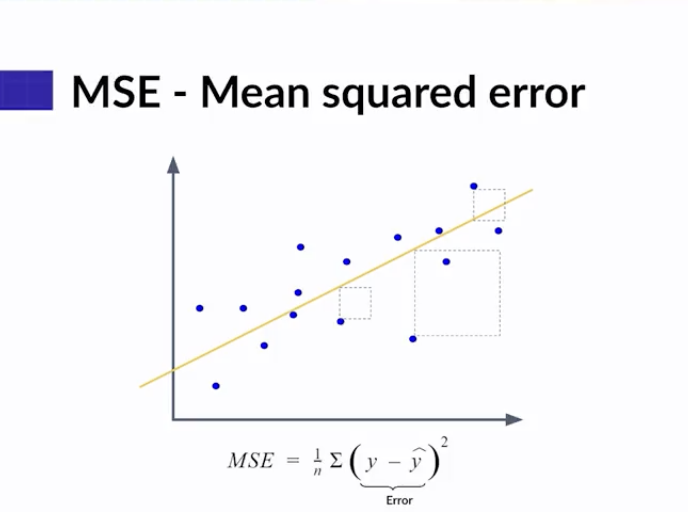 |
